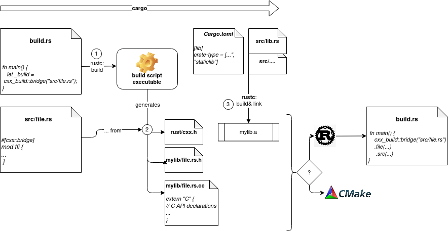

# Template: C++ bindings with Rust

A small template/example project to demonstrate and explain how `C++` bindings can be generated for a `Rust` library using `CMake` and [cxx](https://github.com/dtolnay/cxx). 

## The Cxx crate
Reference: https://cxx.rs/

### Build flow


## CLI example

### Shim library built with Rust 
Built the Rust library with:
```
cargo b --features=build_shim
```
this already builts (with `build.rs`) a static library including the sources generated by `cxx`  and as well those of the shim layer (`shim/src/deep_thought.cpp`).

With `CMake` we just need to import this library and include the generated headers (see `shim/CMakeLists.txt`) and can link the target against the executable:
```
cmake -S . -B target/cmake
cmake --build target/cmake
```

### Shim library built with CMake/Corrosion 

[Corrosion](https://github.com/corrosion-rs/corrosion) allows to build rust crates directly within `CMake`. It also has a (still unstable) helper to create a `CMake` target of the bindings generated by `cxx`. Linking against this, we then can build our shim layer just using `CMake` (see `shim/CMakeLists.txt`): 
```
cmake -S . -B target/cmake -DBUILD_SHIM=1
cmake --build target/cmake
```


### Inspecting
You can inspect the symbols contained in the linked libraries e.g. with `nm` :
```
nm -goC target/debug/librs_cpp_ffi_template.a
```

### Running the CLI
Just execute
```
./target/cmake/cli/deep_thought_cli
```
and prompt your question which `DeepThought™` will gladly answer.

# Challenges
- async rust
  - cxx is working on coroutine support
- generics not supported
- linker issues